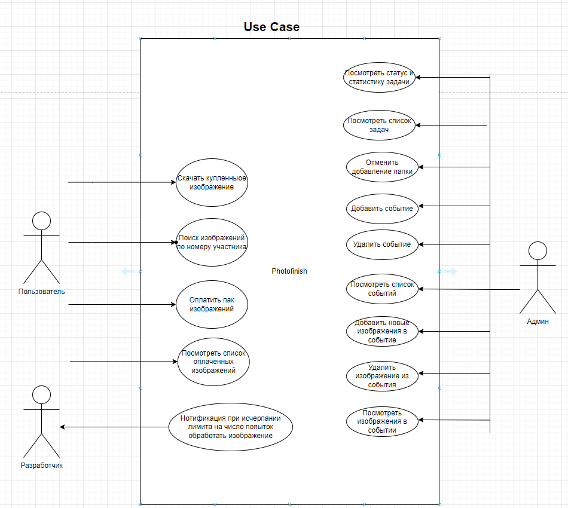
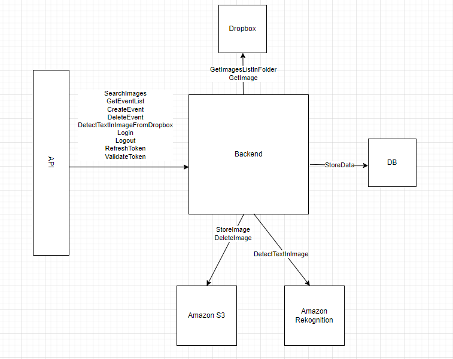
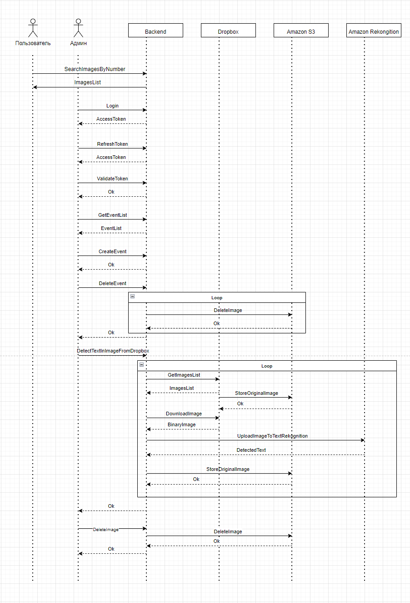

# Simple face recognizer
[Available at](https://damp-lake-99927.herokuapp.com/)
[Available at ](https://thawing-sea-83431.herokuapp.com/)

## Setting Credentials
Setting your credentials for use by the AWS SDK can be done in a number of ways,  
but here are the recommended approaches:

Set credentials in the AWS credentials profile file on your local system, located at:

`~/.aws/credentials` on Linux, macOS, or Unix

`C:\Users\USERNAME\.aws\credentials` on Windows

This file should contain lines in the following format:

Install [go-migrate](https://github.com/golang-migrate/migrate)

`+
[default]`  
`aws_access_key_id = your_access_key_id` 
`aws_secret_access_key = your_secret_access_key`
## Clone repo
`git clone https://github.com/bearname/photofinish-frontend frontend`
## First building run command
`make download`
## Build
`make build`
## Run
`make up`
## Migration
`make migrateup`

Open http://localhost:3000

### Use case

### Components

### Sequence Diagram

